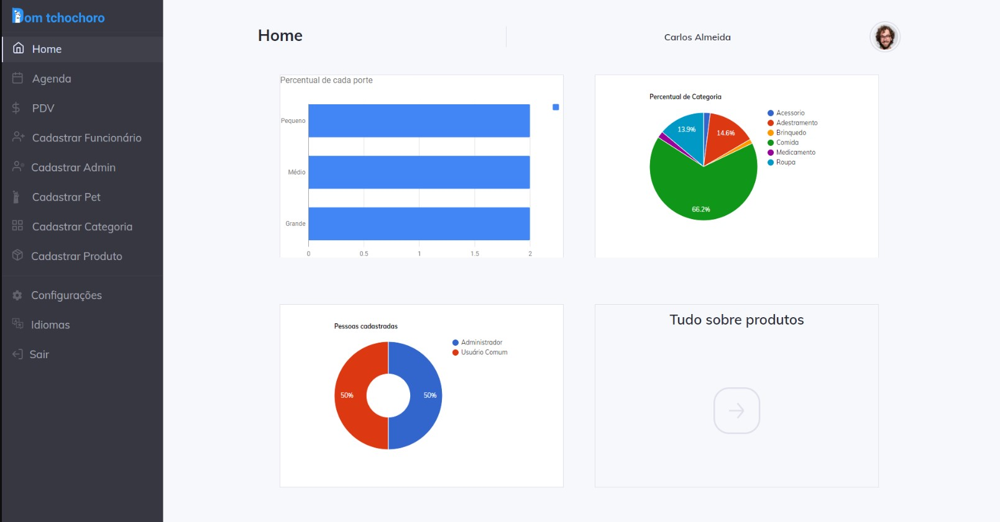

  
  
Manage your pet shop <strong>now</strong>

## 💡 Project 

Application created to manage a pet shop, and have the purpose to help the employee

This application was created domining front end, back end and database using c#.

[Layout](https://www.figma.com/file/UJFXTSXoJaS9ppkDxmkcHd/Asp-net?node-id=0%3A1) application in figma.

## 💻 Screenshots

<table>
	<tr>
		<th width="50%">
			Login Interface 
		</th>
		<th width="50%">
			Home page 
		</th>
	</tr>	
	</tr>
	<tr>
		<td>
			
		</td>
		<td>
			
		</td>
	</tr>
</table>

## 🧾 Features

* Two Level of access, Administrator adn Employee.
* The Administrator may login in the application and register the employees, register new products, schedule an appointment and manage the cashier.
* The Employee may manage the cashier.
* An agenda to schedule baths and shears for your dog 🐕
* An point of sale

## 🛠 Tools 

- [Cleave.js](https://nosir.github.io/cleave.js/)
- [MySql](https://www.nuget.org/packages/MySql.Data/)
- [Bootstrap](https://getbootstrap.com)
- [C#])(https://docs.microsoft.com/en-us/dotnet/csharp/)

## ⚙ Database
It's a Mysql database, the script is named "db_asp.net.sql".

▶ Getting Started
---------------

1. Download the code.
2. Open the code in Microsoft Visual Studio.
3. Run the script on MySql.
4. Run the web system.
